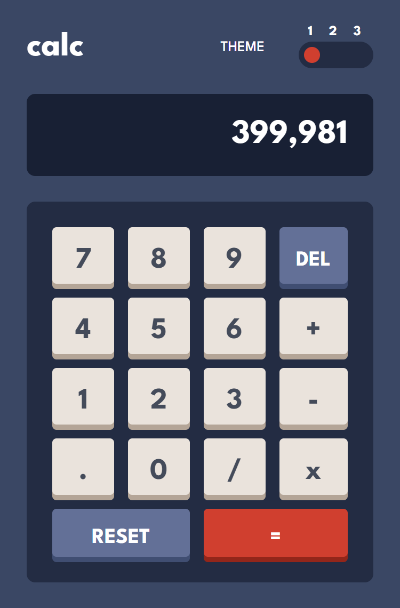
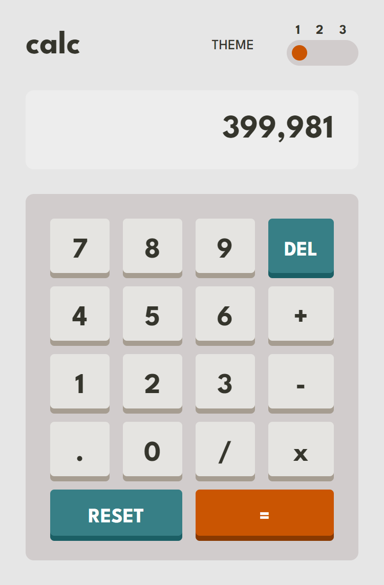
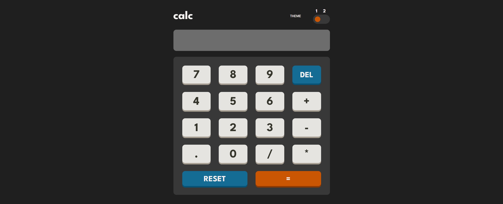
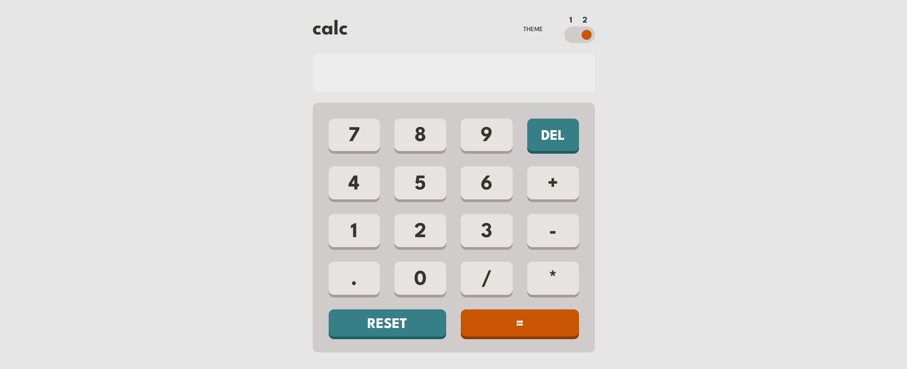

# Calculadora
Solução para criar uma calculadora responsiva para mobile e desktop

## Índice

- [Visão geral](#visao-geral)
  - [O Desafio](#o-desafio)
  - [Screenshot](#screenshot)
- [Minha caminhada](#minha-caminhada)
  - [Propriedades](#propriedades)
  - [O que aprendi](#o-que-aprendi)
  - [Recursos](#recursos)
- [Autor](#autor)

## Visão Geral

### O Desafio

Os usuários devem ser capazes de:

- Visualizar o tamanho dos elementos ajustados com base no tamanho da tela do dispositivo (mobile e desktop)

- Realizar operações matemáticas como adição, subtração, multiplicação e divisão

- Ajustar o tema de cores com base em sua preferência

### Screenshots

<html>
  <h4>Layout mobile tema padrão</h4>
  
  <h4>Layout mobile tema claro </h4>
  
  <h4>Layout desktop tema padrão</h4>
  
  <h4>Layout desktop tema claro</h4>
  
</html>

## Minha caminhada

- [x] Layout mobile
- [x] Layout desktop
- [x] Features da calculadora
- [x] Feature de temas

### Propriedades

- Mobile-first
- Semântica HTML
- CSS BEM
- CSS Flexbox
- JavaScript DOM manipulation
- JavaScript data flow

### Meu aprendizado
Desta vez meu conhecimento da base de JavaScript foi consolidado, ao desenvolver uma calculadora muitos aspectos foram praticados como iteração de arrays, atributos de evento HTLM, métodos, condicionais para validação, arrow functions, function expression, etc...

Trechos de destaque:

HTML
```html
...
<div class="buttons">

  <button class="button__buttons button__numbers-operations">7</button>
  <button class="button__buttons button__numbers-operations">8</button>
  <button class="button__buttons button__numbers-operations">9</button>
  <button class="button__buttons button__functional">DEL</button>
  <button class="button__buttons button__numbers-operations">4</button>
  <button class="button__buttons button__numbers-operations">5</button>
  <button class="button__buttons button__numbers-operations">6</button>
  <button class="button__buttons button__numbers-operations">+</button>
  <button class="button__buttons button__numbers-operations">1</button>
  <button class="button__buttons button__numbers-operations">2</button>
  <button class="button__buttons button__numbers-operations">3</button>
  <button class="button__buttons button__numbers-operations">-</button>
  <button class="button__buttons button__numbers-operations">.</button>
  <button class="button__buttons button__numbers-operations">0</button>
  <button class="button__buttons button__numbers-operations">/</button>
  <button class="button__buttons button__numbers-operations">*</button>
  <button class="button__buttons button__functional button__reset">RESET</button>
  <button class="button__buttons button__equal">=</button>
            
</div>
...
```
JavaScript
```javascript
...
// iteração da lista de botões
buttons.forEach((button) => {
    // Aciona o evento de click em cada botão da lista
    button.addEventListener("click", (e) => {
        const value = e.target.innerText;
        // Valida os valores dos botões
        if (+value >= 0 || value === ".") {
            insert(value);
        } else if (value === "DEL") {
            delet();
        } else if (value === "RESET") {
            clean();
        } else if (value === "=") {
            calculate();
        } else {
            insert(value);
        };

    });

});
...
```

### Recursos
- [JS - .forEach() na MDN](https://developer.mozilla.org/pt-BR/docs/Web/JavaScript/Reference/Global_Objects/Array/forEach) - Esse artigo vai te ajudar a entender como utilizar o iterador de array.

- [JS - .addEventListener() na MDN](https://developer.mozilla.org/pt-BR/docs/Web/API/EventTarget/addEventListener) - Esse artigo vai te ajudar a entender como utilizar o método de instância.

- [JS - If...else na MDN](https://developer.mozilla.org/pt-BR/docs/Web/JavaScript/Reference/Statements/if...else) - Esse artigo vai te ajudar a entender como utilizar a condicional.

- [O desafio da Frontend Mentor](https://www.frontendmentor.io/challenges/calculator-app-9lteq5N29) - Neste link você encontrará o desafio solucionado aqui.

## Autor

- LinkedIn - [Pedro A. Lima](https://www.linkedin.com/in/pedrolima626/)
